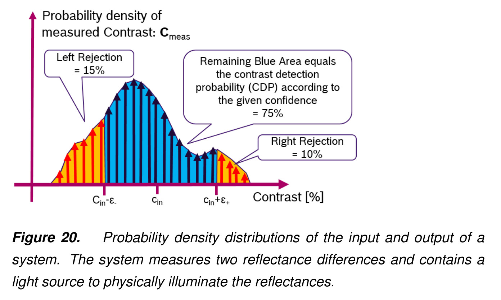
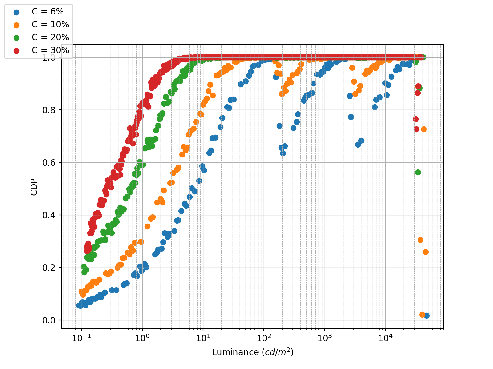
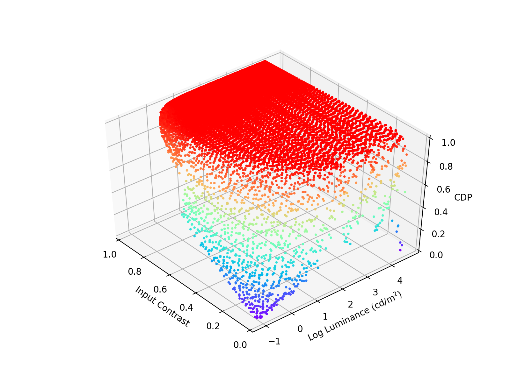
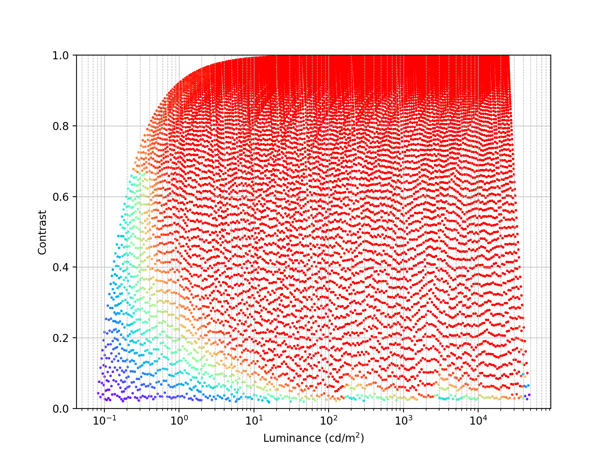

# Contrast Detection Probability Calculator

This repository provides:

* A tool for calculating [contrast detection probability](https://www.image-engineering.de/content/library/conference_papers/2019_02_28/EIC2019_CDP.pdf) (CDP) of an imaging system

* A simulated imaging system for generating HDR images given scene luminance map, and alternatively

* A utility for annotating and extracting RoIs from CDP test patterns in [Image Engineering® DTS](https://www.image-engineering.de/products/solutions/all-solutions/dynamic-test-stand) device

# What is CDP?

Contrast detection probability (CDP) is a metric to *describe the performance of an imaging system to reproduce contrasts in the physical scenes*. Since a distinguishable contrast in an image is a prerequisite for modern computer vision algorithms, CDP can be regarded as a core functionality to measure the *CV-oriented image quality* of an imaging system.

More detailed introduction and use cases about CDP can be found in [\[1\]](#ref1), [\[2\]](#ref2), and [\[3\]](#ref3).

# Basic idea

By its theoretical definition, CDP is the ratio of the area under a contrast-pdf (probability distribution function) curve, constrained by an upper and a lower bounds (, where  is the target contrast and  is a confidence interval), to the whole area under this pdf curve (see Fig. 1). In a discrete digital imaging system, however, we can only obtain this ratio by dividing the number of observations withing the bounds by the number of all observations.

<em>CDP definition in <a href="#ref2">[2]</a></em>

Inspired by Image Engineering® [DTS-Evaluation software](https://www.image-engineering.de/content/products/solutions/dynamic_test_stand/downloads/Dynamic_Test_Stand_product_summary.pdf), this tool calculates CDP based on an RoI-to-RoI manner, i.e., given two flatten patches with known contrast and luminance levels (in cd/m2), the CDP is calculated by counting the number of pixel-pairs from two image RoIs that are able to reproduce that contrast value, then dividing by the number of all possible pixel-pairs.

For example, given two neutral patches in the physical world with luminance 100cd/m2 and 300cd/m2 respectively, their contrast is  following the Michelson contrast definition. Suppose we use a camera to capture this scene, and get an output image with two 10*10 square RoIs corresponding to these two patches, then the CDP can be obtained by counting the ratio of all pixel-pairs that reproduce the target contrast (based on pixel values), to the total 1002=10,000 pixel-pairs.

A CDP value is a function of the target contrast value, the target luminance level (by averaging the luminance of two patches), and, of course, the characteristic of the imaging system. So if camera A produces a higher CDP values then camera B, we can say that camera A has higher probability to distinguish the objects with a certain degree of difference, and at a certain luminance level, in their real use scenarios.

# Usage

### CDP Calculator

The [`CDPCalculator`](cdp_calculator.py#L12) class now supports two calculating mode: *user-specified target contrast(s) mode* and *all target contrasts mode*:

* The user-specified target contrast(s) mode is run by calling [`calculate()`](cdp_calculator.py#L43) method. Given a set of patches with known luminance levels and an interesting target contrast value (or several contrast values), this method will search from all patch-pairs and find those that satisfy this target contrast value(s). The CDP values will be calculated for all these patch-pairs. See figure below.  

<em>CDPs with respect to different luminance levels. Here four target contrasts (6%, 10%, 20%, and 30%) are evaluated</em>

* The all target contrasts mode is run by calling [`calculate_all()`](cdp_calculator.py#L93) method. In this mode the CDP values will be calculated for all possible patch-pairs. See figures below.  

<em>CDPs with respect to different target contrasts and luminance levels</em>

<em>Same as above figure, in top view</em>

### Simulated Imaging System & DTS RoIs Extractor

TODO

# Reference

<a name="ref1">\[1\]</a> Detection Probabilities: Performance Prediction for Sensors of Autonomous Vehicles. Geese M, Seger U, and Paolillo A (2018)

<a name="ref2">\[2\]</a> Contrast Detection Probability - Implementation and Use Cases. Artmann U, Geese M, Gäde M (2019)

<a name="ref3">\[3\]</a> Imatest Documentation: Contrast Detection Probability. https://www.imatest.com/docs/cdp/

# License

Copyright 2020 Qiu Jueqin

Licensed under [MIT](http://opensource.org/licenses/MIT).